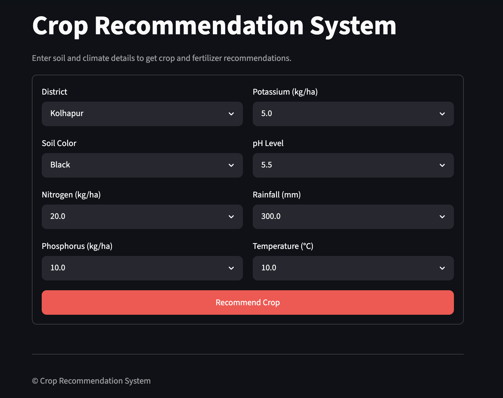
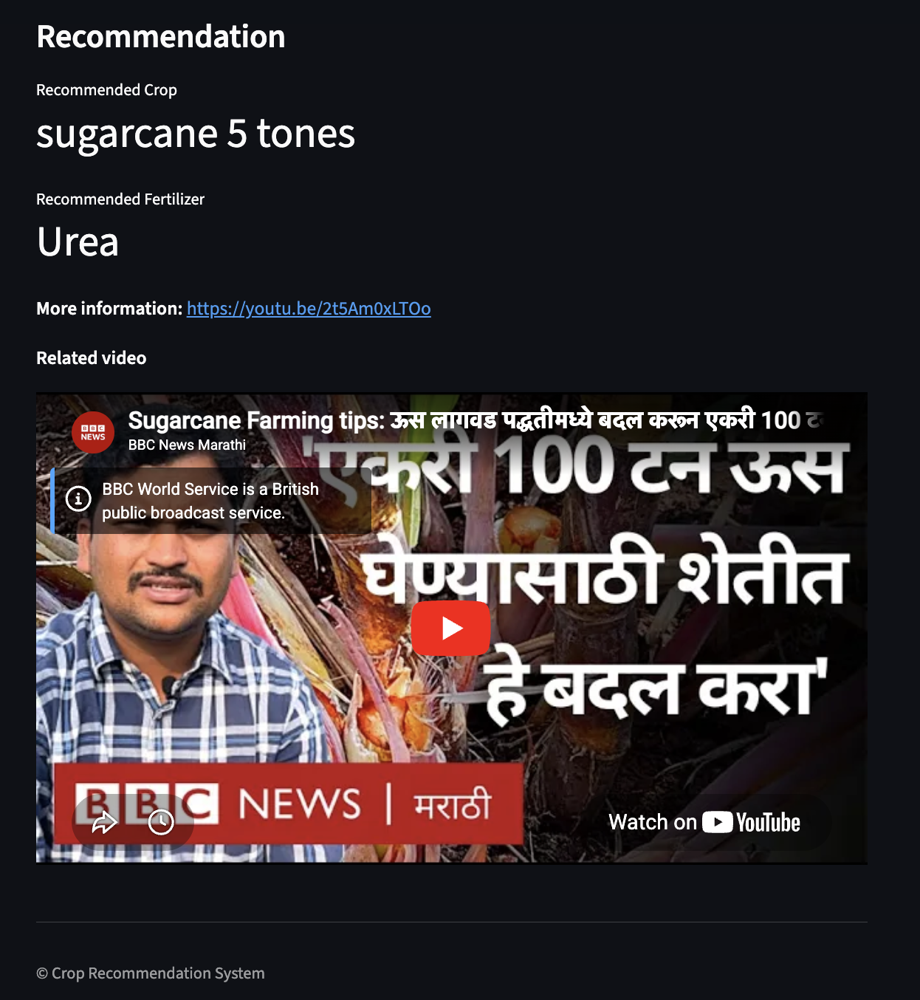

# 🌱 Smart Crop Recommendation System

An intelligent Machine Learning-based web application that recommends the most suitable crop based on soil properties and environmental conditions. The system also provides fertilizer recommendations, crop-related information, and YouTube learning resources to help farmers improve agricultural productivity.


---

## 📖 Overview

The **Smart Crop Recommendation System** is an AI-powered agricultural decision support application developed using **Python, Machine Learning, and Streamlit**.

The application predicts the most suitable crop by analyzing soil and environmental parameters such as soil color, nutrient levels, pH, rainfall, and temperature. It further assists farmers by recommending fertilizers, displaying crop-related information, and providing YouTube learning resources for cultivation.

---

## ✨ Features

- 🌾 Machine Learning-based crop recommendation
- 🌍 District-wise crop prediction
- 🌱 Fertilizer recommendation
- 🧪 Soil nutrient analysis (N, P, K)
- 🌡️ Climate-based prediction using rainfall and temperature
- 📚 Crop information
- 🎥 Embedded YouTube cultivation videos
- 💻 Responsive Streamlit web application
- ⚡ Fast and accurate predictions

---

## 🛠️ Tech Stack

| Technology | Purpose |
|------------|---------|
| Python | Programming Language |
| Streamlit | Web Framework |
| Pandas | Data Processing |
| NumPy | Numerical Computing |
| Scikit-learn | Machine Learning |
| Pickle | Model Serialization |

---

## 📂 Project Structure

```text
Smart-Crop-Recommendation-System/
│
├── app.py
├── Crop and fertilizer dataset.csv
├── requirements.txt
├── .gitignore
├── README.md
└── screenshots/
    ├── home.png
    └── recommendation.png
```

---

## 📊 Input Parameters

The prediction model uses the following inputs:

- District
- Soil Color
- Nitrogen (N)
- Phosphorus (P)
- Potassium (K)
- Soil pH
- Rainfall
- Temperature

---

## 🎯 Output

After processing the inputs, the application provides:

- ✅ Recommended Crop
- ✅ Recommended Fertilizer
- ✅ Crop Information
- ✅ YouTube Learning Resource
- ✅ Agricultural Decision Support

---

# 📸 Application Screenshots

## Home Page

> Users can enter soil properties and climatic conditions to receive crop recommendations.



---

## Recommendation Result

> The application predicts the most suitable crop, recommends fertilizer, and provides YouTube resources for cultivation.



---

## 🧠 Machine Learning Workflow

```text
Agricultural Dataset
          │
          ▼
 Data Preprocessing
          │
          ▼
 Feature Engineering
          │
          ▼
 Model Training
          │
          ▼
 Model Evaluation
          │
          ▼
 Saved ML Model
          │
          ▼
 Streamlit Web Application
          │
          ▼
 Crop Recommendation
```

---

## ⚙️ Installation

### Clone Repository

```bash
git clone https://github.com/BadikeRaju/Smart-Crop-Recommendation-System.git
```

### Navigate to Project Folder

```bash
cd Smart-Crop-Recommendation-System
```

### Install Dependencies

```bash
pip install -r requirements.txt
```

### Run the Application

```bash
streamlit run app.py
```

The application will be available at:

```
http://localhost:8501
```

---

## 📦 Requirements

- Python 3.9+
- Streamlit
- Pandas
- NumPy
- Scikit-learn

Install all dependencies using:

```bash
pip install -r requirements.txt
```

---

## 🚀 How It Works

1. Select the district.
2. Choose the soil color.
3. Enter Nitrogen, Phosphorus, and Potassium values.
4. Provide soil pH.
5. Enter rainfall and temperature.
6. Click **Recommend Crop**.
7. The Machine Learning model predicts the most suitable crop.
8. The system recommends an appropriate fertilizer.
9. A YouTube cultivation guide is displayed for the selected crop.

---

## 🌾 Applications

- Smart Farming
- Precision Agriculture
- Agricultural Decision Support
- Crop Planning
- Farmer Assistance
- Sustainable Farming

---

## 🔮 Future Enhancements

- 🌦️ Weather API Integration
- 📍 GPS-based Location Detection
- 🌱 Soil Sensor Integration
- 📱 Android Application
- 🌐 Multi-language Support
- 🤖 AI Chatbot for Farmers
- 🦠 Crop Disease Detection using Deep Learning

---

## 👨‍💻 Author

**Badike Raju**

📧 Email: rajubadike23@gmail.com

🔗 LinkedIn: https://www.linkedin.com/in/raju-badike/

💻 GitHub: https://github.com/BadikeRaju

---

## ⭐ Support

If you found this project useful, consider giving it a **⭐ Star** on GitHub.

Your support motivates me to build more AI and Machine Learning projects.
